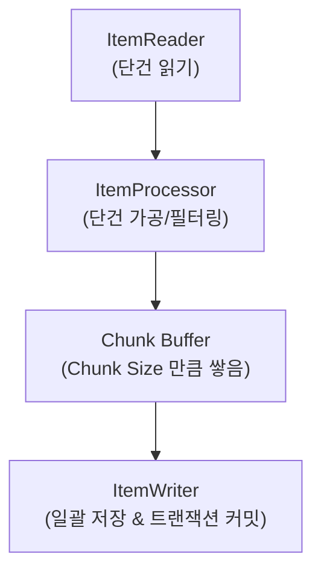
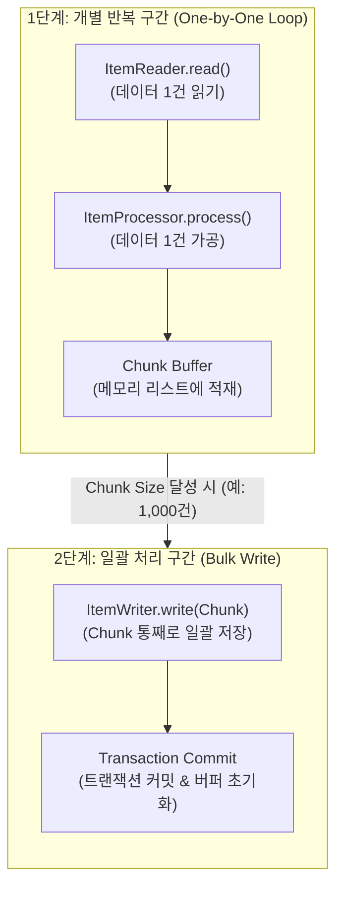

# 06. Chunk 지향 처리 (Chunk-oriented Processing)

앞선 문서들에서는 단일 작업(단발성 실행)을 처리하는 **Tasklet** 중심의 배치 구조를 다루었습니다.  
이번 문서에서는 대용량 데이터 처리의 핵심이자 Spring Batch의 강력한 기능인 **Chunk 지향 처리 (Chunk-oriented Processing)**에 대해 알아봅니다.

---

## 1. Chunk 지향 처리란?

**Chunk**는 '큰 덩어리'를 의미합니다. **Chunk 지향 처리**란 대용량 데이터를 한 번에 메모리에 다 올리는 것이 아니라, **지정한 개수(Chunk Size)만큼 쪼개서 읽고 가공한 뒤 저장하는 방식**입니다.

### Tasklet vs Chunk 지향 처리

| 구분 | Tasklet | Chunk 지향 처리 |
|:---|:---|:---|
| **처리 방식** | 단일 스레드 내에서 하나의 작업 단위 전체를 수행 | 데이터를 지정한 Chunk 단위로 나누어 반복 수행 |
| **적합한 작업** | 파일 삭제, DB 단순 상태 변경, 알림 발송 등 단발성 작업 | 수만~수백만 건의 대용량 데이터 조회/가공/저장 |
| **메모리 효율성** | 데이터를 모두 메모리에 로딩해야 하므로 OOM 위험 존재 | Chunk 단위로만 메모리에 적재하므로 메모리 사용량 일정 |
| **트랜잭션** | Tasklet 1회 실행 단위로 트랜잭션 처리 | Chunk 단위마다 독립된 트랜잭션 커밋 수행 |

---

## 2. Chunk 지향 처리의 3대 요소

Chunk 지향 처리 Step은 크게 **ItemReader**, **ItemProcessor**, **ItemWriter** 3가지 컴포넌트로 구성됩니다.



1. **ItemReader (읽기)**
   - 데이터 소스(DB, File, API 등)에서 데이터를 **단건(1건)**씩 읽어옵니다.
   - 읽어올 데이터가 더 이상 없으면 `null`을 반환하여 읽기 작업 종료를 알립니다.

2. **ItemProcessor (가공/변환)**
   - ItemReader가 읽어온 단건 데이터를 **가공, 변환, 검증**하는 역할을 수행합니다.
   - 비즈니스 로직에 따라 불필요한 데이터는 `null`을 반환하여 **필터링(Skip)**할 수 있습니다. (`null`을 반환하면 ItemWriter로 전달되지 않음)
   - *선택 사항(Optional)*: 가공 로직이 필요 없다면 ItemProcessor를 생략하고 Reader ➔ Writer로 직접 연결할 수도 있습니다.

3. **ItemWriter (쓰기)**
   - Chunk Size만큼 모인 데이터 리스트(List/Chunk)를 전달받아 DB에 **일괄(Bulk Write) 저장**하거나 외부로 출력합니다.
   - ItemWriter 작업이 완료되면 **해당 Chunk에 대한 DB 트랜잭션이 최종 커밋(Commit)**됩니다.

---

## 3. 내부 데이터 흐름 (Data Flow)

Chunk 지향 처리의 내부 실행 메커니즘은 **개별 반복 구간(One-by-One)**과 **일괄 처리 구간(Bulk Write)** 두 단계로 나누어 동작합니다.



### 1) 개별 반복 구간 (One-by-One)
1. **ItemReader**가 DB에서 데이터 **1건**을 읽어옵니다.
2. **ItemProcessor**가 읽어온 **1건**을 비즈니스 로직으로 가공합니다.
3. 가공된 데이터는 메모리 상의 임시 저장소인 **Chunk Buffer**에 쌓입니다.
4. 설정한 **Chunk Size**(예: 1,000건)가 채워질 때까지 1~3번 과정을 **1,000번 반복**합니다.

### 2) 일괄 처리 구간 (Bulk Write)
5. Chunk Buffer에 데이터가 **Chunk Size(1,000건)**만큼 차면, **ItemWriter**에게 리스트 통째로 전달합니다.
6. **ItemWriter**가 `saveAll()` 등으로 DB에 일괄 저장(Bulk Insert/Update)을 수행합니다.
7. 해당 Chunk의 **트랜잭션이 커밋(Commit)**되고 Chunk Buffer가 비워집니다.
8. 전체 대상 데이터가 소진될 때까지 위 과정(1~7)을 반복합니다.

---

## 4. 예제 코드 (Spring Batch 5 / Spring Boot 3+)

다음은 숫자 데이터를 읽어 10을 곱한 뒤 일괄 출력하는 간단한 Chunk 지향 처리 예제 코드입니다.

```java
@Slf4j
@Configuration
@RequiredArgsConstructor
public class ChunkOrientedJobConfig {

    private final JobRepository jobRepository;
    private final PlatformTransactionManager transactionManager;

    private static final int CHUNK_SIZE = 10;

    @Bean
    public Job chunkOrientedJob() {
        return new JobBuilder("chunkOrientedJob", jobRepository)
                .start(chunkStep())
                .build();
    }

    @Bean
    public Step chunkStep() {
        return new StepBuilder("chunkStep", jobRepository)
                .<Integer, String>chunk(CHUNK_SIZE)
                .transactionManager(transactionManager)
                .reader(itemReader())
                .processor(itemProcessor())
                .writer(itemWriter())
                .build();
    }

    @Bean
    public ItemReader<Integer> itemReader() {
        List<Integer> numbers = Arrays.asList(1, 2, 3, 4, 5, 6, 7, 8, 9, 15, 20);
        return new ListItemReader<>(numbers); // 단건씩 꺼내어 반환하는 Reader
    }

    @Bean
    public ItemProcessor<Integer, String> itemProcessor() {
        return item -> {
            // 짝수이거나 10 이하인 데이터만 처리 (필터링 테스트)
            if (item > 10) {
                log.info("Processor Filtered (item > 10): {}", item);
                return null; // null 반환 시 Writer로 전달되지 않음
            }
            String processedValue = "Processed Item Value: " + (item * 10);
            log.info("Processor Processed: {} -> {}", item, processedValue);
            return processedValue;
        };
    }

    @Bean
    public ItemWriter<String> itemWriter() {
        return chunk -> {
            log.info("================ Bulk Writer Start ================");
            for (String item : chunk) {
                log.info("Writer Writing Item: {}", item);
            }
            log.info("================ Bulk Writer End (Transaction Commit) ================");
        };
    }
}
```

### 핵심 포인트 분석
- **`<Integer, String>chunk(CHUNK_SIZE, transactionManager)`**:
  - 첫 번째 제네릭 타입 (`Integer`): Reader에서 읽어올 타입 (Input)
  - 두 번째 제네릭 타입 (`String`): Processor에서 반환하여 Writer로 전달할 타입 (Output)
  - `CHUNK_SIZE`: 트랜잭션당 처리할 데이터 건수
  - `transactionManager`: Spring Batch 5.0 이상에서는 Chunk Step 정의 시 `PlatformTransactionManager` 전달이 필수입니다.

---

## 5. Page Size vs Chunk Size의 차이점

ItemReader를 다루다 보면 `Page Size`와 `Chunk Size` 두 가지 용어가 나와 자주 혼동하곤 합니다.

- **Chunk Size**: ItemWriter에 전달되는 데이터 개수이자 **트랜잭션 커밋 단위**입니다.
- **Page Size**: ItemReader가 **DB에서 한 번에 SELECT 해오는 Paging 쿼리의 단위**입니다.

```
[DB] ────(SELECT Page Size 1,000개 가져옴)────> [ItemReader 메모리 Buffer]
                                                       │
                                                 (read() 단건 반환)
                                                       ▼
[ItemWriter] <────(Chunk Size 1,000개 모이면 저장)──── [Chunk Buffer]
```

> **💡 실무 권장 사항**:  
> 특별한 이유가 없다면 **`Chunk Size`와 `Page Size`를 동일한 크기(예: 둘 다 1,000)로 설정하는 것이 좋습니다.**  
> 두 크기가 다르면 한 번 조회를 통해 가져온 데이터를 다 쓰기도 전에 또다시 조회 쿼리가 나가거나 페이징 조회가 비효율적으로 이루어질 수 있습니다.

---

## 6. 마무리

이번 문서에서는 대용량 데이터 처리를 위한 **Chunk 지향 처리의 개념과 데이터 흐름, 그리고 기본 구현 구조**에 대해 알아보았습니다.

- Chunk 지향 처리는 데이터를 **Chunk Size** 단위로 쪼개어 읽고 가공한 뒤 트랜잭션을 커밋합니다.
- `ItemReader`와 `ItemProcessor`는 데이터를 **단건(1건)** 단위로 처리하며, `ItemWriter`는 모인 데이터를 **List(Chunk)** 단위로 일괄 처리합니다.

이어지는 다음 문서에서는 DB 조회를 위해 실무에서 가장 많이 사용하는 **Spring Batch의 다양한 ItemReader(JpaPagingItemReader 등)의 종류와 페이징 처리 시 주의사항**에 대해 알아보겠습니다.
