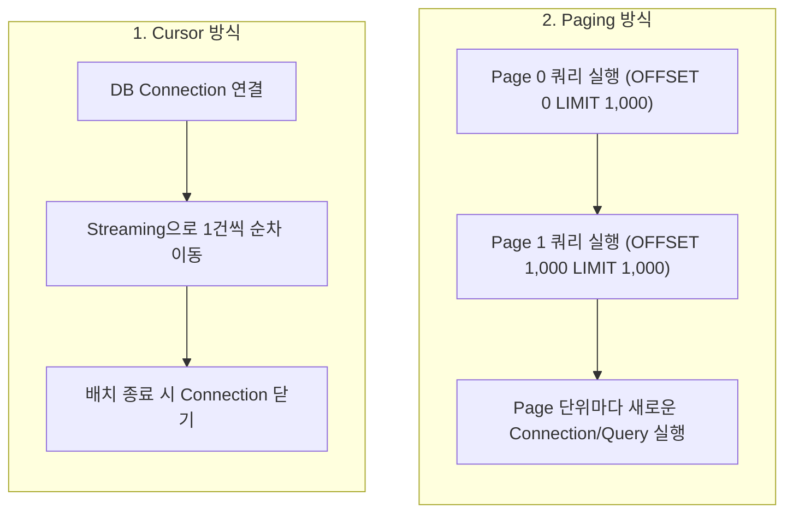
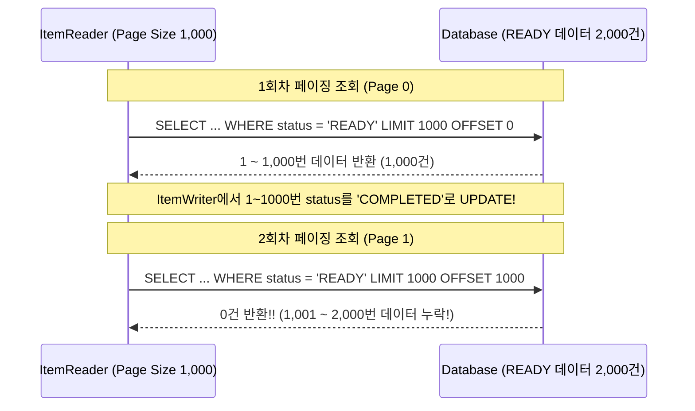

# 07. DB ItemReader의 종류와 페이징 처리 시 주의사항

Spring Batch의 **ItemReader**는 DB, 파일, 네트워크 등 다양한 소스에서 데이터를 읽어오는 역할을 수행합니다.  
실무 배치 시스템에서는 대부분 RDB의 데이터를 다루게 되므로, **DB 전용 ItemReader의 동작 원리와 페이징 조회 시 발생할 수 있는 문제**를 이해하는 것이 매우 중요합니다.

---

## 1. Cursor 방식 vs Paging 방식

Spring Batch가 DB에서 데이터를 읽어오는 방식은 크게 **Cursor 방식**과 **Paging 방식** 2가지로 나뉩니다.



| 구분 | Cursor 방식 | Paging 방식 |
|:---|:---|:---|
| **동작 원리** | DB 커서를 열어 두고 Streaming 방식으로 1건씩 읽어옴 | Page 단위(예: 1,000건)로 SELECT 쿼리를 나누어 실행 |
| **Connection** | 배치 작업이 끝날 때까지 DB Connection 유지 | 페이지 쿼리를 실행할 때만 Connection을 사용하고 반납 |
| **메모리/성능** | DB 커서를 활용하므로 속도가 매우 빠르고 메모리 효율적 | Offset 기반 쿼리 실행으로 뒤쪽 페이지로 갈수록 속도 저하 가능 |
| **주의사항** | Socket Timeout, Connection Timeout 설정 확인 필요 | **페이징 수정 이슈 (Page Offset Trap)** 주의 필요 |

> **💡 실무 선택 가이드**:
> - DB Connection 타임아웃 제약이 타이트하지 않고 빠른 성능이 필요하다면 **Cursor 방식** (`JpaCursorItemReader`, `JdbcCursorItemReader`)이 유리합니다.
> - 병렬 처리(Multi-threaded Step)나 안정적인 Connection 관리가 필요하다면 **Paging 방식** (`JpaPagingItemReader`, `JdbcPagingItemReader`)을 사용합니다.

---

## 2. Spring Batch의 대표적인 DB ItemReader

| 구현체 | 설명 |
|:---|:---|
| `JdbcPagingItemReader` | SQL 기반 페이징 Reader. PagingQueryProvider를 통해 DB별 최적화 쿼리 생성 |
| `JdbcCursorItemReader` | JDBC ResultSet 커서를 이용한 Streaming Reader |
| `JpaPagingItemReader` | JPA Entity 기반 페이징 Reader. JPQL을 사용하여 객체 단위 데이터 조회 |
| `JpaCursorItemReader` | JPA 2.2+ ResultStream을 활용한 Cursor 기반 Reader |
| `RepositoryItemReader` | Spring Data JPA Repository 메서드를 직접 활용하는 Paging Reader |

---

## 3. PagingItemReader의 치명적인 문제: 페이징 건너뛰기 (Page Offset Trap)

실무에서 `JpaPagingItemReader`나 `JdbcPagingItemReader`를 사용할 때 가장 흔하게 발생하는 **데이터 누락 버그**가 있습니다.

### 버그 상황: 읽어온 데이터를 UPDATE할 때 발생

예를 들어, `status = 'READY'`인 주문 데이터 2,000건을 읽어 정산 후 `status = 'COMPLETED'`로 UPDATE하는 배치가 있다고 가정합시다. (Chunk Size = 1,000)



### 원인 분석
1. **1회차 (Page 0, OFFSET 0)**: `READY` 데이터 2,000건 중 1~1,000번을 읽어와 `COMPLETED`로 변경합니다.
2. 이제 DB에 남은 `READY` 데이터는 1,001~2,000번 (총 1,000건)이 됩니다.
3. **2회차 (Page 1, OFFSET 1000)**: Reader는 Page 번호를 1로 증가시켜 `OFFSET 1000` 쿼리를 날립니다.
4. 그러나 DB 관점에서는 남은 `READY` 데이터가 1,000건뿐이므로 `OFFSET 1000`을 적용하면 **아무것도 조회되지 않습니다!**
5. 결과적으로 **1,001~2,000번 데이터 1,000건이 처리되지 않고 건너뛰어지는(Skipped) 대참사**가 발생합니다.

---

### 해결 방법 3가지

#### 1) Page 번호를 항상 0으로 고정하기 (Custom Reader 전략)
데이터가 UPDATE되어 조회 대상에서 제외된다면, Page 번호를 1, 2, 3으로 올리지 않고 **항상 Page 0(OFFSET 0)으로 고정**해서 조회해야 합니다.
```java
// JpaPagingItemReader override 예시
JpaPagingItemReader<Orders> reader = new JpaPagingItemReader<>() {
    @Override
    public int getPage() {
        return 0; // 항상 0번째 페이지를 읽어오도록 고정
    }
};
```

#### 2) CursorItemReader 사용하기
Cursor 방식은 Offset 쿼리를 사용하지 않고 Cursor 포인터를 따라 순차적으로 읽으므로, 중간에 데이터 상태가 변경되어도 건너뛰기 현상이 발생하지 않습니다.

#### 3) UPDATE 대상 조건과 조회 조건 분리하기
`WHERE status = 'READY'`처럼 상태가 계속 바뀌는 컬럼 대신, **`WHERE orderDate = :targetDate`**처럼 배치가 실행되어도 바뀌지 않는 불변(Immutable) 조건으로 조회합니다.

---

## 4. JPA 사용 시 추가 주의사항 (N+1 & 영속성 컨텍스트)

### 1) N+1 문제와 Fetch Join
`JpaPagingItemReader`에서 연관된 엔티티를 함께 읽어올 때 Fetch Join을 쓰지 않으면 Chunk Size(1,000건)만큼 N+1 쿼리가 폭발적으로 실행됩니다.
```java
// N+1 발생
.queryString("SELECT o FROM Orders o")

// 오 Fetch Join으로 1번의 쿼리로 조회
.queryString("SELECT o FROM Orders o JOIN FETCH o.store")
```

### 2) 영속성 컨텍스트 메모리 관리 (`clearPersistenceContext`)
`JpaPagingItemReader`는 기본적으로 페이지 조회가 끝날 때마다 영속성 컨텍스트를 비워주는 **`clearPersistenceContext(true)`가 기본값**으로 설정되어 있습니다.  
이 값을 강제로 `false`로 바꾸면 대용량 데이터 처리 시 100만 개 엔티티가 영속성 컨텍스트에 계속 남아 **OOM**이 발생하므로 기본값을 유지해야 합니다.

---

## 5. 예제 코드 (JpaPagingItemReader & JpaCursorItemReader)

```java
@Slf4j
@Configuration
@RequiredArgsConstructor
public class ItemReaderJobConfig {

    private final JobRepository jobRepository;
    private final PlatformTransactionManager transactionManager;
    private final EntityManagerFactory entityManagerFactory;

    private static final int CHUNK_SIZE = 1000;

    @Bean
    public Job jpaPagingItemReaderJob() {
        return new JobBuilder("jpaPagingItemReaderJob", jobRepository)
                .start(jpaPagingStep())
                .build();
    }

    @Bean
    public Step jpaPagingStep() {
        return new StepBuilder("jpaPagingStep", jobRepository)
                .<Orders, Settlement>chunk(CHUNK_SIZE)
                .transactionManager(transactionManager)
                .reader(jpaPagingItemReader(null))
                .processor(ordersToSettlementProcessor())
                .writer(settlementItemWriter())
                .build();
    }

    // JpaPagingItemReader (파라미터 지연 바인딩을 위해 @StepScope 적용)
    @Bean
    @StepScope
    public JpaPagingItemReader<Orders> jpaPagingItemReader(
            @Value("#{jobParameters['orderDate']}") String orderDate) {

        Map<String, Object> parameters = new HashMap<>();
        parameters.put("orderDate", LocalDate.parse(orderDate));

        return new JpaPagingItemReaderBuilder<Orders>()
                .name("jpaPagingItemReader")
                .entityManagerFactory(entityManagerFactory)
                .pageSize(CHUNK_SIZE)
                // 조회가 진행되어도 변경되지 않는 orderDate 기준으로 조회하여 Page Offset Trap 방지
                .queryString("SELECT o FROM Orders o WHERE o.orderDate = :orderDate ORDER BY o.id")
                .parameterValues(parameters)
                .build();
    }

    @Bean
    public ItemProcessor<Orders, Settlement> ordersToSettlementProcessor() {
        return order -> {
            int fee = (int) (order.getAmount() * 0.03);
            int settlementAmount = order.getAmount() - fee;
            return new Settlement(order.getId(), order.getStoreName(), settlementAmount, LocalDate.now());
        };
    }

    @Bean
    public JpaItemWriter<Settlement> settlementItemWriter() {
        return new JpaItemWriterBuilder<Settlement>()
                .entityManagerFactory(entityManagerFactory)
                .build();
    }
}
```

---

## 6. 마무리

이번 문서에서는 **DB ItemReader의 종류(Cursor vs Paging)와 실무에서 페이징 처리 시 발생하는 Offset 건너뛰기 함정**에 대해 알아보았습니다.

- 데이터 상태를 UPDATE하는 배치에서는 **Page Offset Trap**으로 인한 데이터 누락 위험이 큽니다.
- 이를 막기 위해 **CursorItemReader 사용**, **조회 조건의 불변성 유지**, 또는 **Page 0 고정 전략**을 활용해야 합니다.

이어지는 다음 문서에서는 데이터 가공과 필터링을 담당하는 **ItemProcessor와 ItemWriter의 커스텀 구현법 및 Composite 패턴**에 대해 알아보겠습니다.
