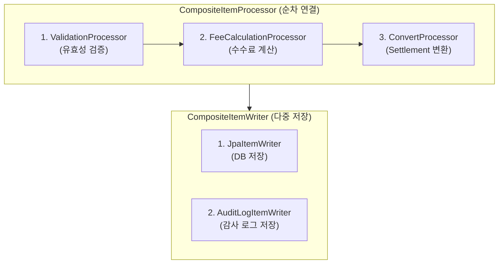

# 08. ItemProcessor와 ItemWriter의 커스텀 구현법 및 Composite 패턴

Spring Batch의 Chunk 지향 처리에서 **ItemProcessor**는 데이터의 가공·검증·필터링을 담당하고, **ItemWriter**는 최종 데이터의 저장 및 출력을 담당합니다.  
이번 문서에서는 이 두 컴포넌트의 커스텀 구현 방법과 여러 Processor/Writer를 조합하는 **Composite 패턴**에 대해 알아봅니다.

---

## 1. ItemProcessor 커스텀 구현과 역할

`ItemProcessor<I, O>`는 입력 타입(`I`)을 받아 출력 타입(`O`)으로 변환하는 인터페이스입니다.

```java
@FunctionalInterface
public interface ItemProcessor<I, O> {
    O process(@NonNull I item) throws Exception;
}
```

### 주요 역할 3가지

1. **데이터 변환 (Transformation)**: `Orders` 엔티티를 받아 `Settlement` 엔티티로 변환
2. **데이터 필터링 (Filtering)**: 조건에 맞지 않는 데이터는 **`null`을 반환**하면 Writer로 전달되지 않고 건너뜁니다.
3. **데이터 검증 (Validation)**: 필수 값이 누락되었거나 비즈니스 규칙 위반 시 예외를 발생시키거나 `null` 반환

### 람다 및 커스텀 클래스 구현 방식

```java
// 1) 람다(Lambda) 방식 구현
@Bean
public ItemProcessor<Orders, Settlement> ordersProcessor() {
    return order -> {
        if (order.getAmount() <= 0) {
            return null; // 금액이 0 이하이면 필터링 (Writer로 전달되지 않음)
        }
        return new Settlement(order.getId(), order.getStoreName(), order.getAmount() - 300, LocalDate.now());
    };
}

// 2) 별도 클래스로 커스텀 구현 (복잡한 로직이나 재사용이 필요한 경우)
public class CustomOrdersProcessor implements ItemProcessor<Orders, Settlement> {
    @Override
    public Settlement process(Orders order) throws Exception {
        // 복잡한 가공 로직 수행
        return new Settlement(...);
    }
}
```

---

## 2. ItemWriter 커스텀 구현과 역할

`ItemWriter<T>`는 ItemProcessor에서 전달받은 **Chunk 단위의 데이터 리스트(Chunk)**를 한 번에 받아 저장하거나 처리합니다.

```java
@FunctionalInterface
public interface ItemWriter<T> {
    void write(@NonNull Chunk<? extends T> chunk) throws Exception;
}
```

> **💡 참고**: Spring Batch 5.0 이상에서는 `write(List<? extends T> items)` 대신 **`write(Chunk<? extends T> chunk)`** 타입을 사용합니다.

### 커스텀 Writer 구현 예시

`JpaItemWriter` 같은 기존 프레임워크 제공 라이터 외에 외부 REST API 호출, 큐 전송, 로그 기록 등 커스텀 작업이 필요할 때 직접 작성합니다.

```java
@Bean
public ItemWriter<Settlement> customItemWriter() {
    return chunk -> {
        log.info("Chunk 크기: {}건 일괄 저장/처리 시작", chunk.size());
        for (Settlement settlement : chunk) {
            // DB 직접 저장, 외부 API 호출, 파일 쓰기 등 수행
            log.info("정산 데이터 처리 중: store={}, amount={}", settlement.getStoreName(), settlement.getSettlementAmount());
        }
    };
}
```

---

## 3. Composite 패턴 (체이닝과 분기 처리)

실무에서는 단 하나의 Processor나 Writer만으로 로직이 끝나지 않는 경우가 많습니다.  
Spring Batch는 여러 Processor와 Writer를 하나로 묶어주는 **Composite 패턴**을 공식 지원합니다.



### 1) CompositeItemProcessor (순차 가공)
여러 개의 Processor를 순서대로 연결하여 **체인(Chain) 형태**로 데이터를 가공합니다.
- `P1` (검증) ➔ `P2` (계산) ➔ `P3` (변환)
- 중간에 어느 하나라도 `null`을 반환하면 다음 Processor는 실행되지 않고 즉시 필터링됩니다.

```java
@Bean
public CompositeItemProcessor<Orders, Settlement> compositeProcessor() {
    List<ItemProcessor<?, ?>> delegates = new ArrayList<>();
    delegates.add(validationProcessor());   // 1차: 검증
    delegates.add(settlementProcessor());   // 2차: 변환

    CompositeItemProcessor<Orders, Settlement> processor = new CompositeItemProcessor<>();
    processor.setDelegates(delegates);
    return processor;
}
```

---

### 2) CompositeItemWriter (다중 일괄 쓰기)
동일한 Chunk 데이터를 **여러 Writer에게 동시/순차적으로 전달하여 각각 처리**하도록 합니다.
- 예: DB에 `Settlement`를 저장하는 동시에, 감사(Audit) 로그 DB에도 기록하거나 외부 시스템으로 전송할 때 사용합니다.

```java
@Bean
public CompositeItemWriter<Settlement> compositeWriter() {
    List<ItemWriter<? super Settlement>> delegates = new ArrayList<>();
    delegates.add(jpaItemWriter());      // 1: DB 저장
    delegates.add(customLogWriter());    // 2: 로그 기록

    CompositeItemWriter<Settlement> writer = new CompositeItemWriter<>();
    writer.setDelegates(delegates);
    return writer;
}
```

---

### 3) ClassifierCompositeItemWriter (조건별 분기 쓰기)
데이터의 특정 상태나 값에 따라 **서로 다른 ItemWriter로 분류하여 저장**하고 싶을 때 사용합니다.
- 예: 주문 금액이 100만 원 이상인 건은 `VipSettlementWriter`로, 그 외는 `StandardSettlementWriter`로 분기하여 처리

```java
@Bean
public ClassifierCompositeItemWriter<Settlement> classifierWriter() {
    ClassifierCompositeItemWriter<Settlement> writer = new ClassifierCompositeItemWriter<>();
    writer.setClassifier((Classifier<Settlement, ItemWriter<? super Settlement>>) settlement -> {
        if (settlement.getSettlementAmount() >= 1000000) {
            return vipItemWriter(); // 100만 원 이상 VIP Writer
        }
        return standardItemWriter(); // 일반 Writer
    });
    return writer;
}
```

---

## 4. 예제 코드 (ProcessorWriterJobConfig.java)

```java
@Slf4j
@Configuration
@RequiredArgsConstructor
public class ProcessorWriterJobConfig {

    private final JobRepository jobRepository;
    private final PlatformTransactionManager transactionManager;

    private static final int CHUNK_SIZE = 5;

    @Bean
    public Job processorWriterJob() {
        return new JobBuilder("processorWriterJob", jobRepository)
                .start(processorWriterStep())
                .build();
    }

    @Bean
    public Step processorWriterStep() {
        return new StepBuilder("processorWriterStep", jobRepository)
                .<Integer, String>chunk(CHUNK_SIZE)
                .transactionManager(transactionManager)
                .reader(simpleNumberReader())
                .processor(compositeProcessor())
                .writer(compositeWriter())
                .build();
    }

    @Bean
    public ListItemReader<Integer> simpleNumberReader() {
        return new ListItemReader<>(Arrays.asList(1, 2, 3, 4, 5, 10, 20, 30));
    }

    // Composite Processor: (1) 필터링 ➔ (2) 문자열 변환
    @Bean
    public CompositeItemProcessor<Integer, String> compositeProcessor() {
        List<ItemProcessor<?, ?>> delegates = Arrays.asList(
                (ItemProcessor<Integer, Integer>) item -> (item % 2 == 0) ? item : null, // 짝수만 필터링
                (ItemProcessor<Integer, String>) item -> "Processed Value: " + (item * 100)  // 값 변환
        );

        CompositeItemProcessor<Integer, String> compositeProcessor = new CompositeItemProcessor<>();
        compositeProcessor.setDelegates(delegates);
        return compositeProcessor;
    }

    // Composite Writer: (1) 콘솔 로그 출력 ➔ (2) 통계 카운트 세기
    @Bean
    public CompositeItemWriter<String> compositeWriter() {
        List<ItemWriter<? super String>> delegates = Arrays.asList(
                chunk -> log.info("[Writer 1 - DB/Log] Writing Chunk: {}", chunk.getItems()),
                chunk -> log.info("[Writer 2 - Audit] Total Items Count: {}", chunk.size())
        );

        CompositeItemWriter<String> compositeWriter = new CompositeItemWriter<>();
        compositeWriter.setDelegates(delegates);
        return compositeWriter;
    }
}
```

---

## 5. 마무리

이번 문서에서는 **ItemProcessor와 ItemWriter의 커스텀 구현법과 Composite 패턴**에 대해 알아보았습니다.

- `ItemProcessor`에서 `null`을 반환하면 해당 데이터는 Writer로 넘어가지 않고 필터링됩니다.
- `CompositeItemProcessor`는 가공 로직을 순차적으로 연결할 수 있게 해 주며, `CompositeItemWriter` / `ClassifierCompositeItemWriter`는 데이터를 다중 저장하거나 조건별로 분기하여 저장할 수 있도록 해 줍니다.
